# Creating-a-High-Availability-Group-of-EC2-Instances-with-Auto-Scaling

In this project, I will describe how to create a high availability group of EC2 instances using Auto Scaling.

1. Create an EC2 launch template with a minimum of 2 instances and a maximum of 5.
2. The Autoscaling group should span at least 3 subnets.
3. Simulate a failure by terminating 1 instance.

Amazon EC2 instances allow you to gain virtual computing capacity in the AWS cloud. Amazon takes care of the actual hardware and you get to rent the virtual machine, to launch applications.

Auto-scaling a group of EC2 instances ensures that your applications remain available. Auto-scaling does the work of monitoring the applications and figuring out how many instances are needed to accommodate fluctuating loads. This is also helpful in keeping costs down.

### Prerequisites

* An AWS free tier account
* A key pair formatted .pem

### Step 1
First login to your AWS account and navigate to the EC2 dashboard. Under Instances click on Launch Templates. From here click the orange Create Launch Template button.

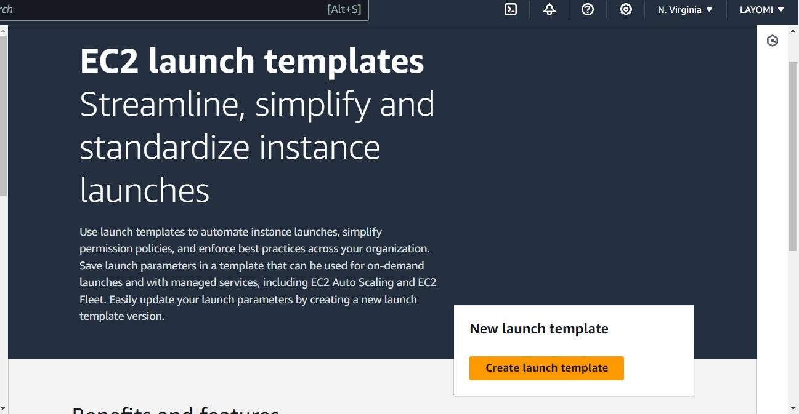

From here you will name your template and provide a brief description. I will check the box for Auto scaling guidance as this will be helpful moving forward!

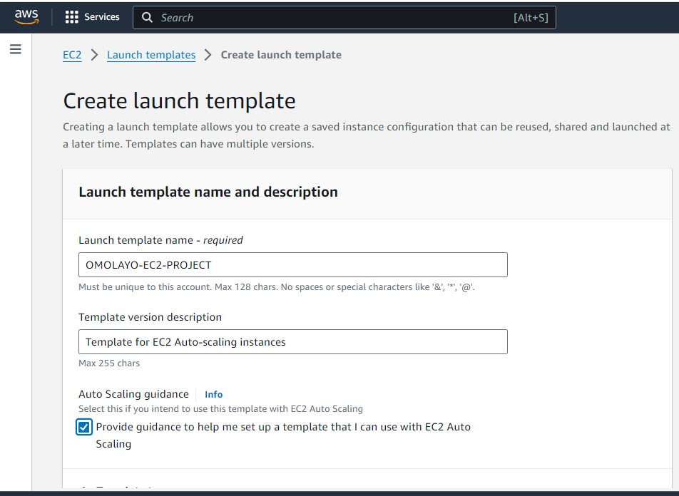

Move on to Launch Template Contents. We will select an AMI (Amazon Machine Image), this is the image we will use to create a template. I chose Amazon Linux 2 AMI 64-bit which is free tier eligible.

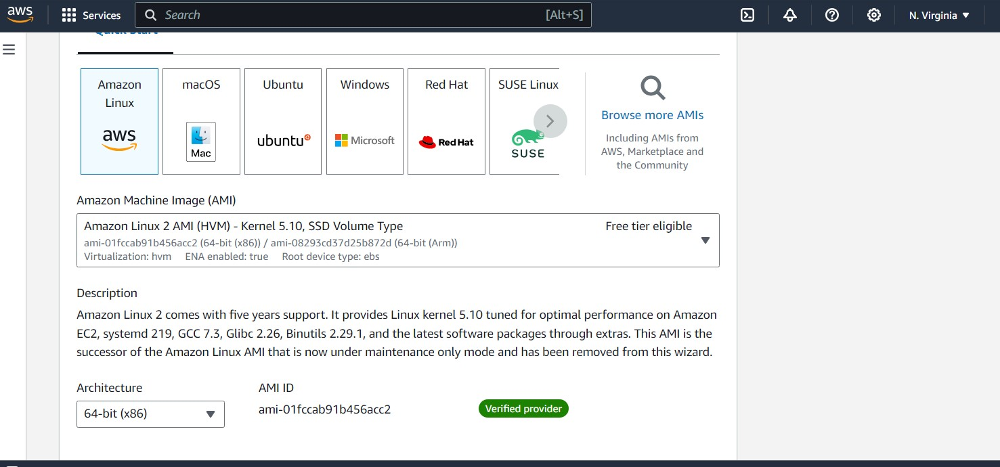

Next select your instance type, depending on how much storage you will need. I went with t2 micro

Then you have the option of creating a key pair or using a key pair you have already created. The key pair is very important because you need it to access your instance from the CLI terminal. Once created you will only have the one opportunity to save the key. I will use a key I have already created.

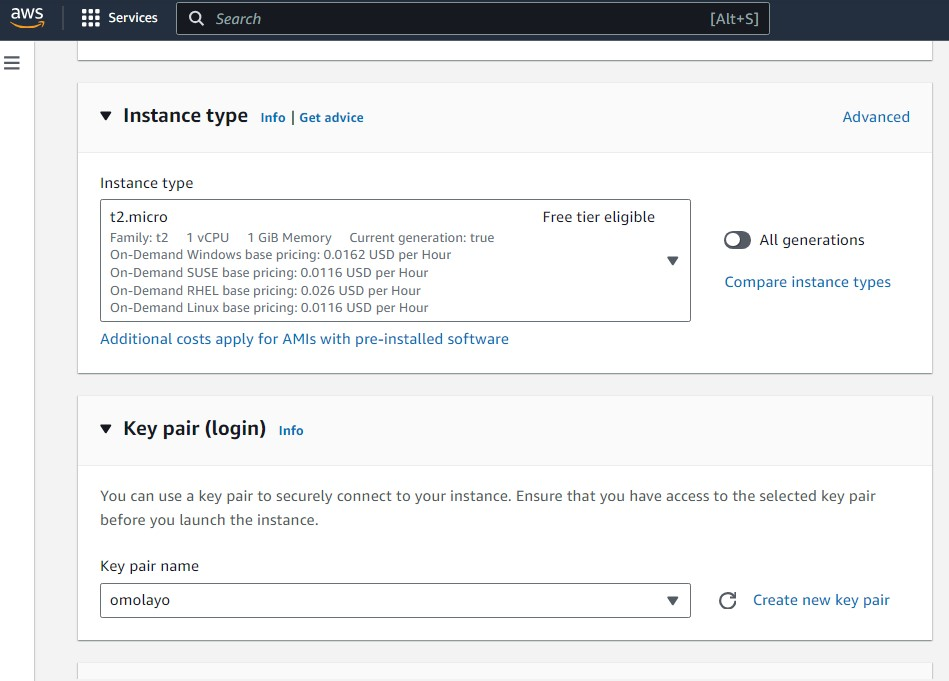

Moving on to Network Settings, you will have the option to create a security group or use an existing security group. I will create a security group; name it, write a description and use the default vpc

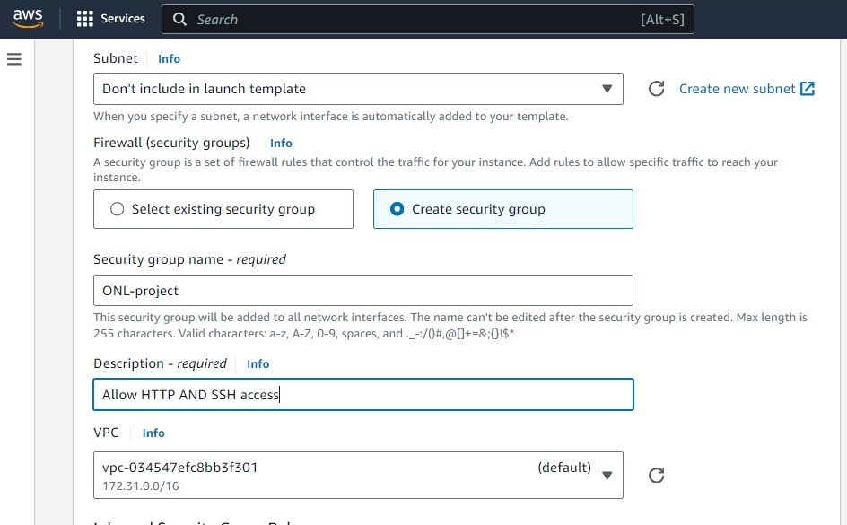

We need to create rules for our security group to allow access to the webserver from the internet and to allow us to access the instance by SSH into the CLI terminal. The source type will be set to anywhere so that anyone can access it. The options I selected are shown below:

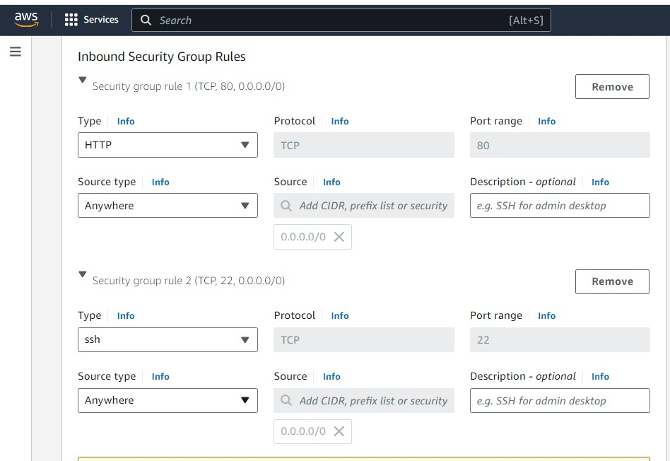

Next up Storage, I will leave on the default setting.

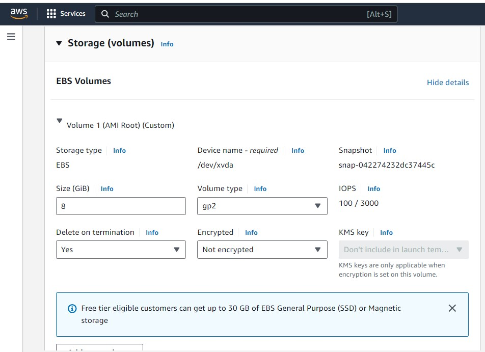

At the bottom of the page click on the Advanced Settings. Here we will leave most of it as the default settings. Scroll down to the User Data text box, we will input a bootstrap script.

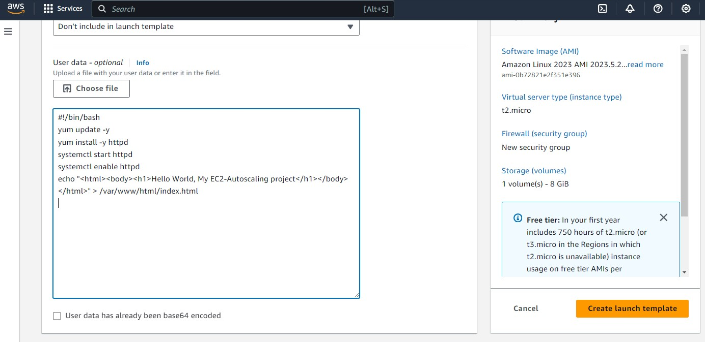

This script will essentially; update our server, install an Apache webserver, and provision a webpage with our script. All in one little text box!

```
#!/bin/bash
yum update -y
yum install -y httpd
systemctl start httpd
systemctl enable httpd
echo "<html><body><h1>Hello World, My EC2-Autoscaling project</h1></body></html>" > /var/www/html/index.html
```

Hit the orange create launch template button when you are done!

### Step 2

Navigate to Auto Scaling and select Auto Scaling groups. Then click create Auto Scaling group.

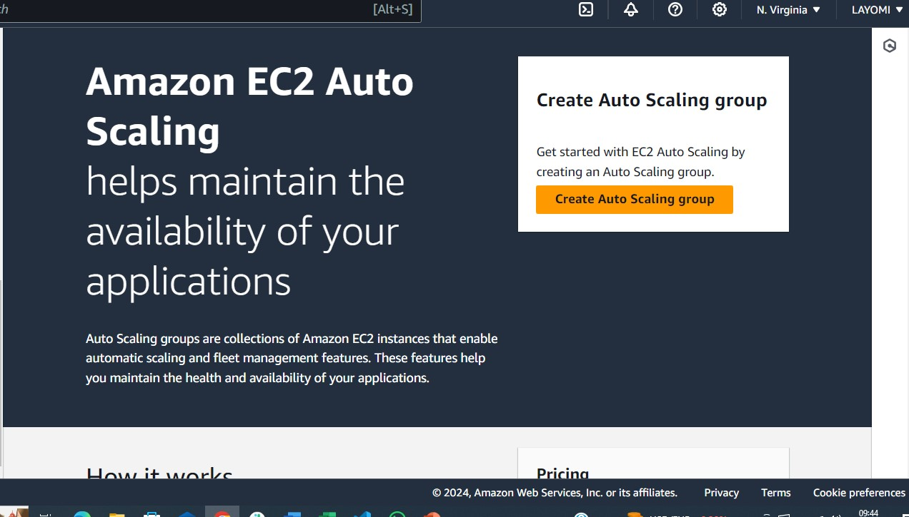

Name your Auto Scaling Group:

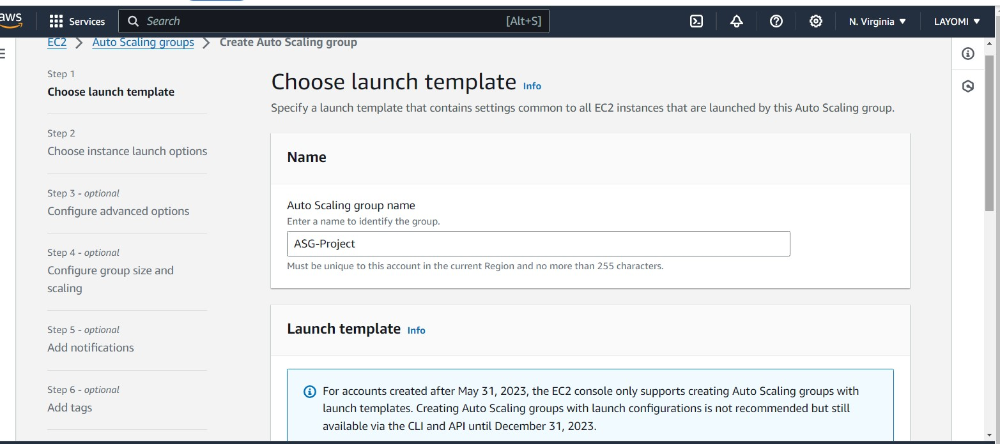

Under Launch Template select the template you just created and click next!

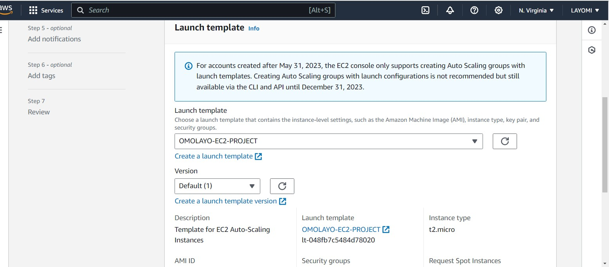

The next screen will show the Network. Keep the default vpc. Under Availability and subnets I will select 4 subnets to provide higher availability.

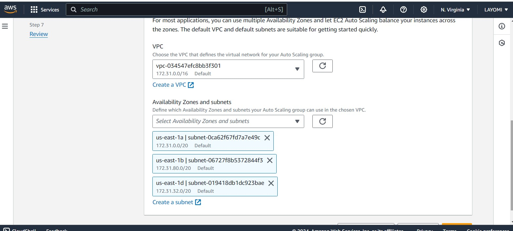

Hit next and hit next again through Configure Advanced Options screen. The screen we will work on now is “Configure group size and scaling policies”. Under group size you can select your desired capacity, minimum and maximum capacity. This will determine the number of instances running depending on CPU load, whether it is high or low.

After that, Hit next, I won’t be adding tags or notifications to this project. You will then be taken to the Review page. Review the details of your Auto Scaling group to ensure everything is correct. Then click Create Auto Scaling Group.


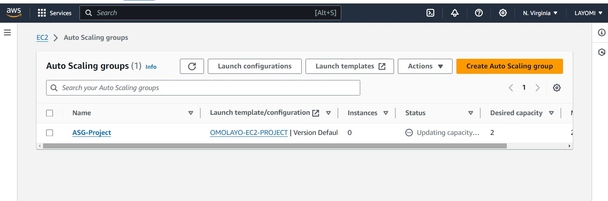

Now navigate to your EC2 instance page. It should show you have instances running.

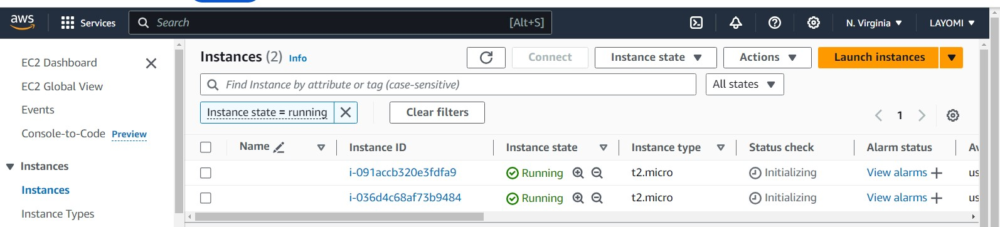

To check if our server and web page are successfully running, just copy the IPV4 address and put it in a browser.

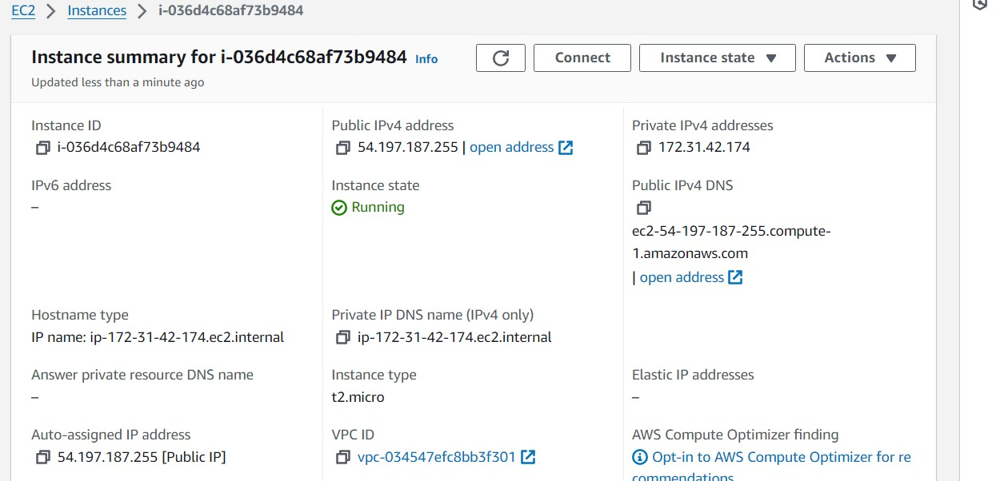

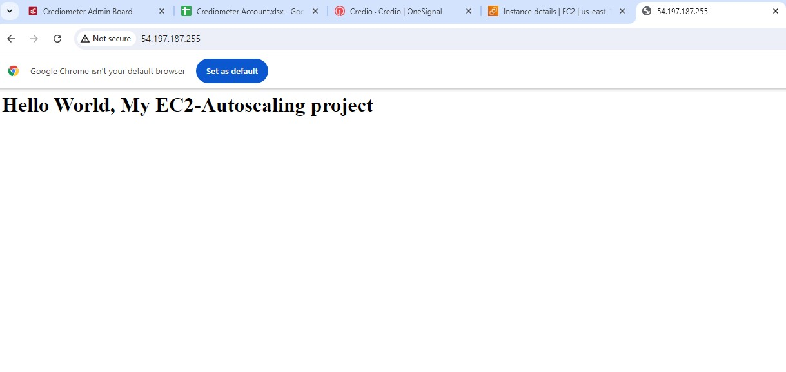

It was successful!

### Step 3

Now to test our Auto-Scaling group we will simulate an instance failure! We will do this by terminating one of our instances. Select an instance, click instance state, and terminate instance.

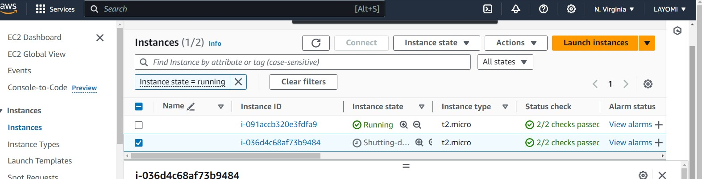

Since our minimum instance was set to 2, another instance will appear to take over the failed instance.

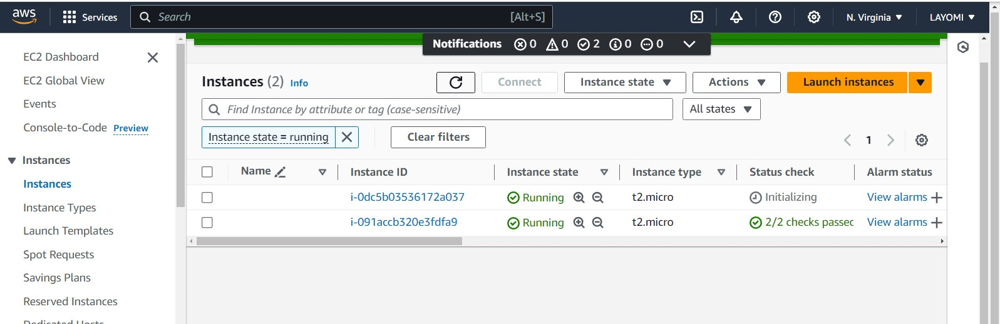

To make sure the new instance is running properly I will again copy the IPV4 address and input it into a browser.

the resuilt is shown below

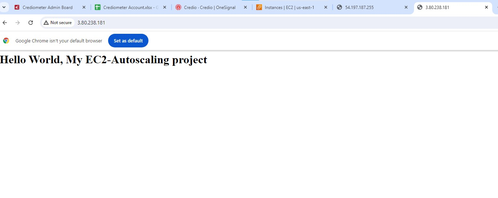

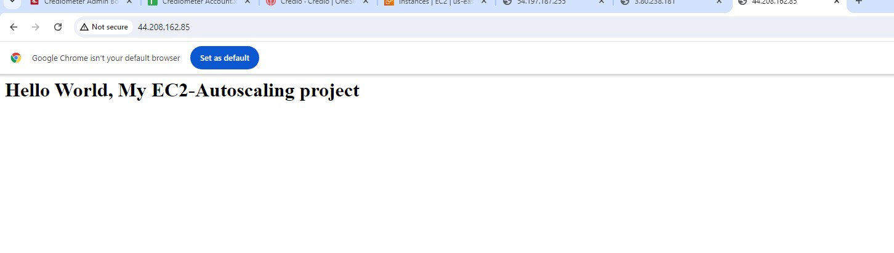

The new instance worked! This shows that even if an instance fails our application will still be available. Auto scaling is a great service provided by aws and this project really showed me how functional it is!

In order to not be charged I recommend deleting your Auto Scale group. This will also terminate any instances associated with it.


COMPLETE 
 